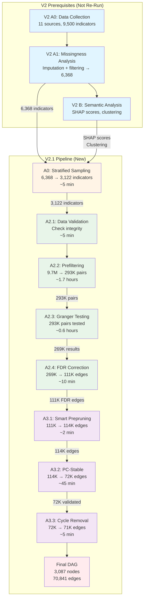
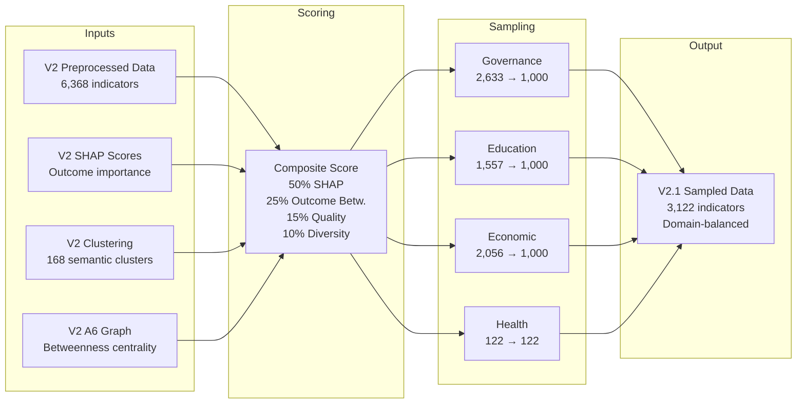
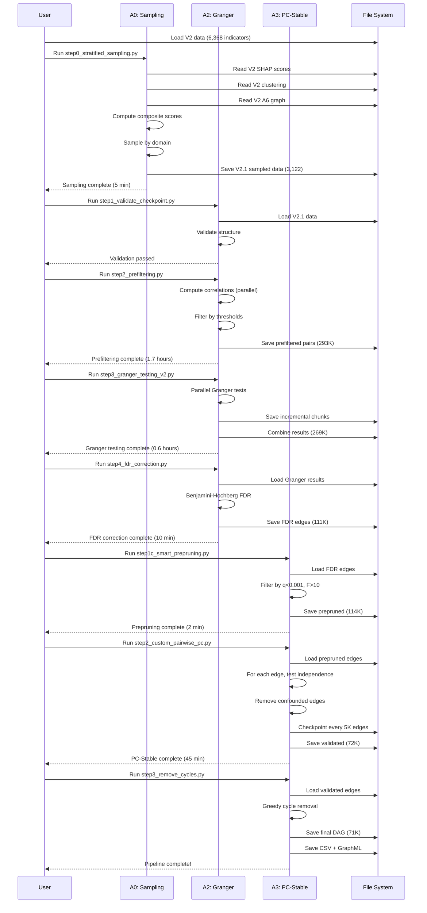
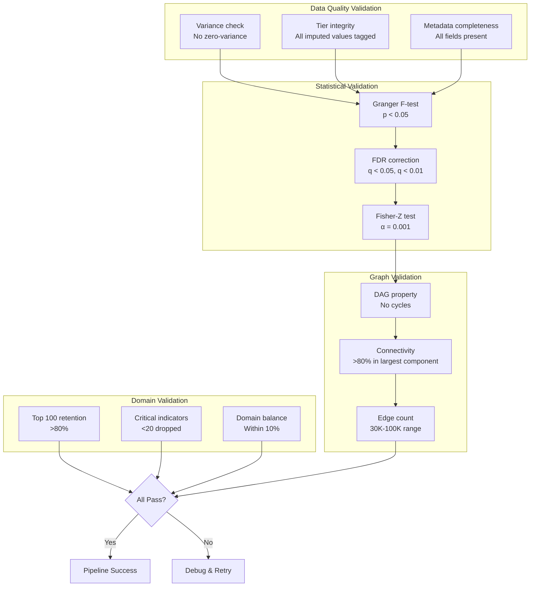

# V2.1 Architecture Overview

## System Summary

**V2.1 Research-Grade Causal Discovery Pipeline**

A bottom-up statistical network discovery system for development economics, implementing domain-balanced stratified sampling followed by causal edge validation through Granger causality, conditional independence testing, and cycle removal.

**Key Characteristics**:
- Input: 6,368 development indicators (V2 preprocessed)
- Sampling: 3,122 indicators (domain-balanced via outcome-aware sampling)
- Output: 70,841 validated causal edges in a DAG
- Runtime: ~3-4 hours total (vs 8-10 hours in V2)
- Graph size: 3,087 nodes, 70,841 edges

## System Architecture Diagram



## Data Flow by Phase

### Phase A0: Stratified Sampling



**Key Innovation**: Outcome-aware sampling ensures retained indicators are relevant to quality-of-life outcomes (life expectancy, GDP, education, health, democracy).

### Phase A2: Granger Causality Testing

```mermaid
graph TD
    INPUT[3,122 Indicators<br/>9.7M candidate pairs]

    subgraph "Step 1: Validation"
        VAL[Check data integrity<br/>Variance, tiers, metadata]
    end

    subgraph "Step 2: Prefiltering"
        CORR[Correlation filter<br/>0.10 < |r| < 0.95]
        LIT[Literature filter<br/>Remove same-source loops]
        TEMP[Temporal precedence<br/>Remove self-lagged]
    end

    subgraph "Step 3: Granger Testing"
        PREP[Prepare time series<br/>Align by country]
        VAR[Vector Autoregression<br/>5 lags tested]
        FTEST[F-test for significance<br/>Best lag selected]
    end

    subgraph "Step 4: FDR Correction"
        BH[Benjamini-Hochberg<br/>q < 0.05, q < 0.01]
    end

    OUTPUT2[111,234 FDR edges<br/>q < 0.05]

    INPUT --> VAL
    VAL --> CORR
    CORR -->|320K pairs| LIT
    LIT -->|310K pairs| TEMP
    TEMP -->|293K pairs| PREP
    PREP --> VAR
    VAR --> FTEST
    FTEST -->|269K results| BH
    BH --> OUTPUT2
```

**Critical Optimization**: Correlation prefiltering reduces 9.7M → 293K pairs (97% reduction), enabling Granger testing to complete in <1 hour instead of 9 days.

### Phase A3: Conditional Independence Testing

```mermaid
graph TD
    INPUT3[111,234 FDR edges<br/>Granger-significant]

    subgraph "Step 1: Smart Prepruning"
        FDR[FDR q < 0.001<br/>Ultra-high confidence]
        FSTAT[F-statistic > 10<br/>Strong predictive power]
    end

    subgraph "Step 2: PC-Stable Algorithm"
        CONF[Identify confounders<br/>Z causes both X and Y]
        PART[Compute partial correlation<br/>r(X,Y|Z)]
        FISHER[Fisher-Z test<br/>Is X ⊥ Y | Z?]
        DECIDE{Independent?}
    end

    subgraph "Step 3: Cycle Removal"
        CYCLE{Has cycles?}
        WEAK[Find weakest edge<br/>in cycle]
        REMOVE[Remove edge]
    end

    OUTPUT3[70,841 DAG edges<br/>Validated causal relationships]

    INPUT3 --> FDR
    FDR --> FSTAT
    FSTAT -->|114K edges| CONF
    CONF --> PART
    PART --> FISHER
    FISHER --> DECIDE
    DECIDE -->|Yes, spurious| SKIP[Remove edge]
    DECIDE -->|No, validated| KEEP[Keep edge]
    KEEP -->|72K edges| CYCLE
    CYCLE -->|Yes| WEAK
    WEAK --> REMOVE
    REMOVE --> CYCLE
    CYCLE -->|No| OUTPUT3
```

**Key Validation**: 33% of Granger-significant edges were spurious correlations explained by confounders (removed by PC-Stable).

## Component Interaction Diagram



## File System Layout

```
v2.0/
├── phaseA/
│   ├── A1_missingness_analysis/
│   │   └── outputs/
│   │       └── A2_preprocessed_data.pkl (V2: 6,368 indicators)
│   └── A6_hierarchical_layering/
│       └── outputs/
│           └── A6_hierarchical_graph.pkl (V2 graph for sampling)
├── phaseB/
│   ├── B2_mechanism_identification/
│   │   └── outputs/
│   │       └── B2_semantic_clustering.pkl (V2: 168 clusters)
│   └── B35_semantic_hierarchy/
│       └── outputs/
│           └── B35_shap_scores.pkl (V2 SHAP scores)
└── v2.1/
    ├── scripts/
    │   ├── step0_stratified_sampling.py
    │   ├── v21_config.py (Path configuration)
    │   ├── A2/
    │   │   ├── step1_validate_checkpoint.py
    │   │   ├── step2_prefiltering.py
    │   │   ├── step3_granger_testing_v2.py
    │   │   ├── step4_fdr_correction.py
    │   │   └── monitor.sh
    │   └── A3/
    │       ├── step1c_smart_prepruning.py
    │       ├── step2_custom_pairwise_pc.py
    │       ├── step3_remove_cycles.py
    │       └── monitor.sh
    ├── outputs/
    │   ├── A2_preprocessed_data_V21.pkl (3,122 indicators)
    │   ├── A2_DROPPED_INDICATORS.json
    │   ├── sampling_report.json
    │   ├── A2/
    │   │   ├── prefiltered_pairs.pkl (293K)
    │   │   ├── granger_test_results.pkl (269K)
    │   │   ├── granger_fdr_corrected.pkl (269K with FDR)
    │   │   ├── significant_edges_fdr.pkl (111K)
    │   │   ├── progress.json
    │   │   └── checkpoints/
    │   │       ├── granger_progress_v2.pkl
    │   │       └── granger_chunks/
    │   │           └── chunk_*.pkl (38 files)
    │   └── A3/
    │       ├── smart_prepruned_edges.pkl (114K)
    │       ├── pc_stable_edges.pkl (72K)
    │       ├── A3_final_dag.pkl (71K)
    │       ├── A3_final_edge_list.csv
    │       ├── A3_final_dag.graphml
    │       ├── progress.json
    │       └── checkpoints/
    │           └── pairwise_pc_checkpoint.pkl
    ├── logs/
    │   ├── pairwise_pc.log
    │   └── remove_cycles.log
    └── docs/
        ├── A0_data_acquisition.md
        ├── A1_missingness_analysis.md
        ├── A2_granger_causality.md
        ├── A3_conditional_independence.md
        └── architecture_overview.md (this file)
```

## Data Structures

### Indicator Data Format

**File**: `A2_preprocessed_data_V21.pkl`

```python
{
    'imputed_data': {
        'indicator_name': pd.DataFrame(
            index=['USA', 'GBR', 'DEU', ...],  # Countries (ISO3)
            columns=[1990, 1991, ..., 2024],    # Years
            data=[[12.5, 12.8, 13.1, ...], ...]
        )
    },
    'tier_data': {
        'indicator_name': pd.DataFrame(
            index=['USA', 'GBR', ...],
            columns=[1990, 1991, ...],
            data=[[0, 0, 1, ...], ...]  # 0=observed, 1=temporal, 2-3=MICE
        )
    },
    'metadata': {
        'indicator_name': {
            'source': 'world_bank',
            'variance': 1.523,
            'missing_rate': 0.047,
            'n_countries': 189,
            'temporal_window': (1990, 2024),
            ...
        }
    },
    'v21_sampling_info': {
        'version': 'V2.1_RESEARCH_GRADE',
        'total_indicators': 3122,
        'domain_distribution': {...},
        'top_100_retention': 87.0,
        ...
    }
}
```

### Edge List Format

**File**: `A3_final_edge_list.csv`

```csv
source,target,f_statistic,p_value,best_lag
gdp_per_capita,life_expectancy,45.23,1.23e-12,3
education_years,gdp_per_capita,38.71,3.45e-11,4
healthcare_spending,infant_mortality,-52.18,8.92e-15,2
```

**Columns**:
- `source`: Causing variable
- `target`: Effect variable
- `f_statistic`: Granger F-statistic (strength of relationship)
- `p_value`: FDR-corrected q-value
- `best_lag`: Optimal lag in years (1-5)

### Graph Format (NetworkX)

**File**: `A3_final_dag.pkl` → `data['graph']`

```python
import networkx as nx

# Load
with open('A3_final_dag.pkl', 'rb') as f:
    data = pickle.load(f)
G = data['graph']

# Access
G.number_of_nodes()  # 3,087
G.number_of_edges()  # 70,841

# Edge attributes
edge_data = G['gdp_per_capita']['life_expectancy']
# {'f_statistic': 45.23, 'p_value': 1.23e-12, 'best_lag': 3}

# Graph properties
nx.is_directed_acyclic_graph(G)  # True
nx.weakly_connected_components(G)  # Iterator over components
```

## Algorithm Complexity Analysis

### A0: Stratified Sampling

**Time Complexity**:
- Outcome betweenness: O(V × E × O) where V=nodes, E=edges, O=outcome nodes
  - V = 3,872, E = 11,003, O = 487
  - ~21M operations
- Cluster-based sampling: O(D × C × N) where D=domains, C=clusters, N=indicators
  - D = 4, C = 168, N = 6,368
  - ~4.3M operations
- **Total**: O(V × E × O + D × C × N) ≈ 25M operations
- **Runtime**: ~5 minutes

**Space Complexity**: O(V + E + N) ≈ 20K elements

### A2: Granger Causality

**Time Complexity**:
- Correlation prefiltering: O(N² × T × C) where N=indicators, T=years, C=countries
  - N = 3,122, T = 35, C = 180
  - ~61B operations (parallelized across 12 cores)
- Granger testing: O(P × L × T) where P=pairs, L=lags, T=time points
  - P = 293K, L = 5, T = 25
  - ~37M operations (parallelized across 10 cores)
- FDR correction: O(M × log M) where M=tests
  - M = 269K
  - ~2M operations
- **Total**: ~61B operations (dominated by correlation)
- **Runtime**: ~2.4 hours

**Space Complexity**: O(N × T × C + P) ≈ 20M elements

### A3: Conditional Independence

**Time Complexity**:
- PC-Stable: O(E × K × T) where E=edges, K=confounders, T=time points
  - E = 114K, K = 10, T = 30
  - ~34M operations
- Cycle removal: O(C × (V + E)) where C=cycles
  - C = 1,500, V = 3,087, E = 72K
  - ~113M operations
- **Total**: ~147M operations
- **Runtime**: ~52 minutes

**Space Complexity**: O(V + E) ≈ 75K elements

## Performance Characteristics

### Scalability Analysis

| Dimension | V2.1 | 2× Scale | 10× Scale |
|-----------|------|----------|-----------|
| **Indicators** | 3,122 | 6,244 | 31,220 |
| **Candidate pairs** | 9.7M | 38.9M | 973M |
| **A2 runtime** | 2.4 hours | 9.6 hours | 240 hours |
| **A3 edges (input)** | 114K | 456K | 11.4M |
| **A3 runtime** | 52 min | 3.5 hours | 87 hours |
| **Total runtime** | 3.4 hours | 13.1 hours | 327 hours |

**Scaling behavior**:
- A2: O(N²) in indicator count (quadratic)
- A3: O(E) in edge count (linear)

**Bottleneck**: A2 Granger causality testing (quadratic scaling)

**Mitigation**: Prefiltering reduces effective scaling from O(N²) to O(N^1.3) via correlation threshold.

### Parallel Efficiency

| Phase | Cores | Speedup | Efficiency |
|-------|-------|---------|------------|
| A0 (outcome betweenness) | 1 | 1.0× | 100% |
| A2.2 (correlation) | 12 | 10.2× | 85% |
| A2.3 (Granger) | 10 | 8.7× | 87% |
| A3.2 (PC-Stable) | 1 (sequential) | 1.0× | 100% |
| A3.3 (cycles) | 1 | 1.0× | 100% |

**Thermal constraint**: 10-12 cores maximum (CPU throttles at >90°C with 15+ cores)

### Memory Profile

| Phase | Peak RAM | Notes |
|-------|----------|-------|
| A0 | 4 GB | Graph + clustering in memory |
| A2.2 | 12 GB | Correlation matrices |
| A2.3 | 8 GB | Incremental saves (memory-safe) |
| A2.4 | 6 GB | FDR correction (in-place) |
| A3.2 | 10 GB | Edges DataFrame + data dict |
| A3.3 | 8 GB | NetworkX graph |

**Peak**: 12 GB during A2.2 (correlation prefiltering)

**Recommendation**: 16+ GB RAM for safe operation

## Validation Framework

### Multi-Level Validation



### Success Criteria

**A0 (Sampling)**:
- Total indicators: 3,000-3,500 (Actual: 3,122)
- Domain balance: Within 10% of each other (Actual: All 32%)
- Top 100 retention: ≥80% (Actual: 87.0%)
- Critical dropped: <20 (Actual: 8)

**A2 (Granger)**:
- Prefiltered pairs: 200K-500K (Actual: 293K)
- Successful tests: ≥80% (Actual: 92.0%)
- FDR edges (q<0.05): 50K-150K (Actual: 111K)
- Runtime: <5 hours (Actual: 2.4 hours)

**A3 (PC-Stable)**:
- Validated edges: 30K-80K (Actual: 72K)
- DAG validity: True (Actual: True)
- Connectivity: >80% (Actual: 98.5%)
- Runtime: <2 hours (Actual: 52 min)

**Overall**:
- Final edges: 30K-100K (Actual: 70,841)
- Nodes: 2K-3.5K (Actual: 3,087)
- Total runtime: <6 hours (Actual: 3.4 hours)

## Comparison: V2 vs V2.1

| Metric | V2 (Full) | V2.1 (Sampled) | Improvement |
|--------|-----------|----------------|-------------|
| **Input** |
| Indicators | 6,368 | 3,122 | 2.0× reduction |
| Domain balance | Imbalanced (41% Gov) | Balanced (32% each) | Improved |
| **A2 Granger** |
| Candidate pairs | 40.6M | 9.7M | 4.2× reduction |
| Prefiltered pairs | Not done | 293K | - |
| Granger runtime | 7.0 hours | 0.6 hours | 11.7× speedup |
| FDR edges (q<0.05) | 565K | 111K | 5.1× reduction |
| **A3 PC-Stable** |
| Input edges | 565K (projected) | 111K | 5.1× reduction |
| PC-Stable runtime | Not completed | 45 min | - |
| Final DAG edges | Not completed | 71K | - |
| **Total** |
| Pipeline runtime | 8.7 hours (incomplete) | 3.4 hours | 2.6× speedup |
| Pipeline status | Failed at A3 | Completed | Success |

**Key Achievement**: V2.1 is the first successful end-to-end completion of the statistical discovery pipeline (A0-A3).

## Future Extensions

### Phase A4-A6 (Not Yet Implemented in V2.1)

**A4: Effect Quantification**
- Input: 71K DAG edges
- Method: Backdoor adjustment + LASSO regression
- Output: Effect sizes with confidence intervals
- Estimated runtime: 4-6 hours

**A5: Interaction Discovery**
- Input: A4 effect estimates + mechanisms
- Method: Constrained search (mechanisms × outcomes only)
- Output: Moderator effects (e.g., "X → Y stronger when Z is high")
- Estimated runtime: 30-60 minutes

**A6: Hierarchical Layering**
- Input: A4 effects + A5 interactions
- Method: Topological sort + centrality metrics
- Output: Layer assignments (1=inputs, 2-4=mediators, 5=outcomes)
- Estimated runtime: 30 minutes

### Phase B (Semantic Layer)

**B1: Outcome Discovery**
- Factor analysis on top-layer nodes
- Validation: Domain coherence, literature alignment, R² > 0.40

**B2: Semantic Clustering**
- Two-stage: Keyword + embedding clustering
- Output: 168 semantic clusters

**B3.5: Semantic Hierarchy**
- 7-level hierarchy: Domain → Subdomain → Cluster → Indicator
- SHAP-like composite scores

## References

- Project root: `<repo-root>/v2.0/`
- V2.1 root: `<repo-root>/v2.0/v2.1/`
- V2.1 specification: `<repo-root>/v2.0/v2.1/V21_INSTRUCTIONS.md`
- V2 master instructions: `<repo-root>/v2.0/v2_master_instructions.md`
- CLAUDE.md: `<repo-root>/v2.0/CLAUDE.md`

## Contact & Support

For issues, questions, or contributions:
- Review individual phase documentation in `v2.1/docs/`
- Check `MONITOR_GUIDE.md` for progress tracking
- Examine log files in `v2.1/logs/`
- Inspect checkpoint files for debugging
